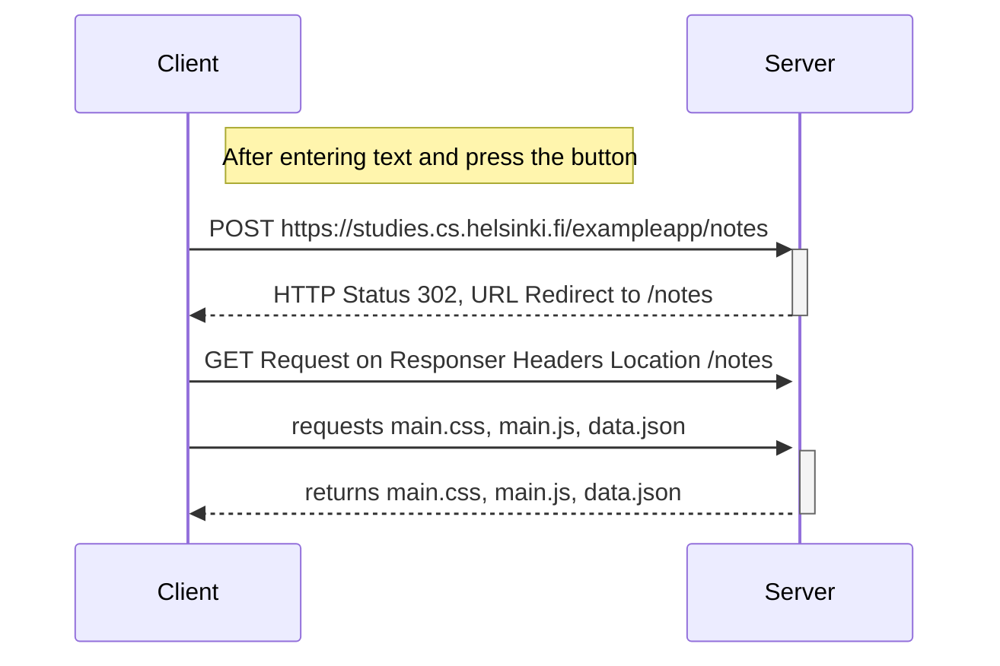

## Mermaid Diagram for 0.4

```mermaid
sequenceDiagram
    note right of Client: After entering text and press the button
    Client->>+Server: POST https://studies.cs.helsinki.fi/exampleapp/notes
    
    Server-->>-Client: HTTP Status 302, URL Redirect to /notes

    Client->>+Server: GET Request on Responser Headers Location /notes
    Client->>+Server: requests main.css, main.js, data.json

    Server-->>-Client: returns main.css, main.js, data.json
```
