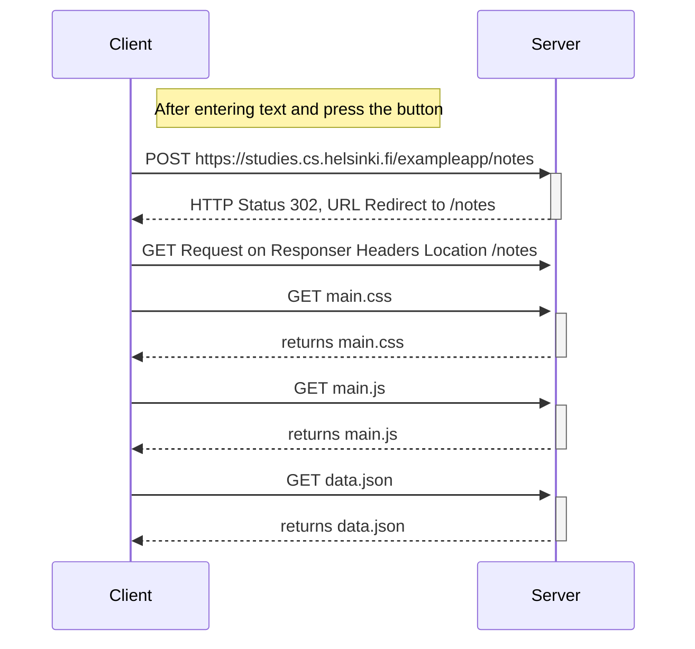
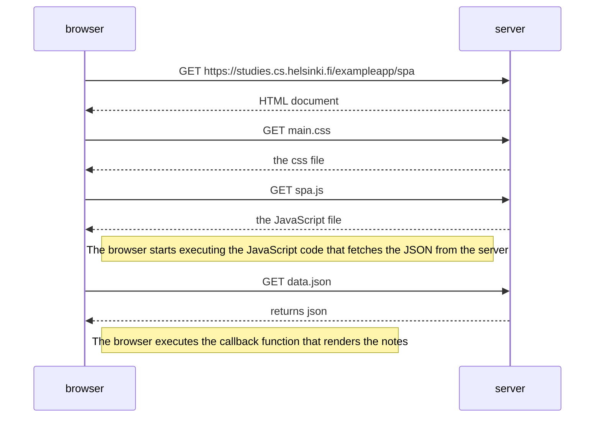
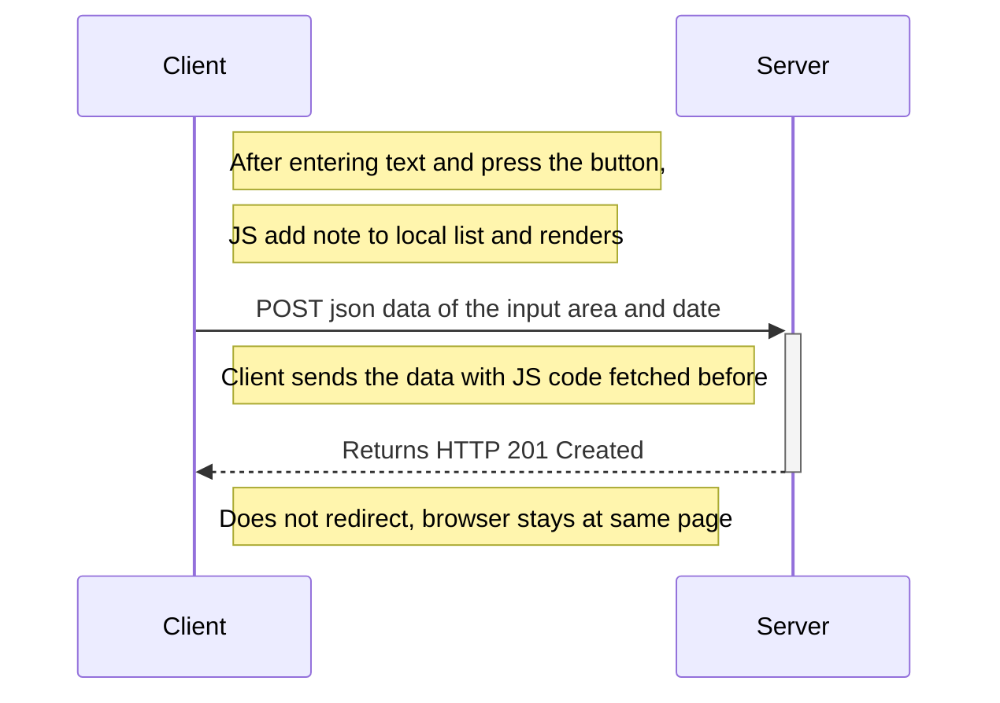

## Exercise 0.4

```mermaid
sequenceDiagram
    note right of Client: After entering text and press the button
    Client->>+Server: POST https://studies.cs.helsinki.fi/exampleapp/notes
    
    Server-->>-Client: HTTP Status 302, URL Redirect to /notes

    Client->>+Server: GET Request on Responser Headers Location /notes
    
    Client->>+Server: GET main.css
    Server-->>-Client: returns main.css

    Client->>+Server: GET main.js
    Server-->>-Client: returns main.js

    Client->>+Server: GET data.json
    Server-->>-Client: returns data.json
```
## Exercise 0.5

```mermaid
    sequenceDiagram
        browser->>server: GET https://studies.cs.helsinki.fi/exampleapp/spa
        server-->>browser: HTML document
    
        browser->>server: GET main.css
        
        server-->>browser: the css file
        
    
        browser->>server: GET spa.js
     
        server-->>browser: the JavaScript file
        
    
        Note right of browser: The browser starts executing the JavaScript code that fetches the JSON from the server
    
        browser->>server: GET data.json
     
        server-->>browser: returns json
        Note right of browser: The browser executes the callback function that renders the notes
```
## Exercise 0.6

```mermaid
    sequenceDiagram
    note right of Client: After entering text and press the button,
    note right of Client: JS add note to local list and renders
    Client->>+Server: POST json data of the input area and date
    note right of Client: Client sends the data with JS code fetched before
    Server-->>-Client: Returns HTTP 201 Created
    note right of Client: Does not redirect, browser stays at same page
```
